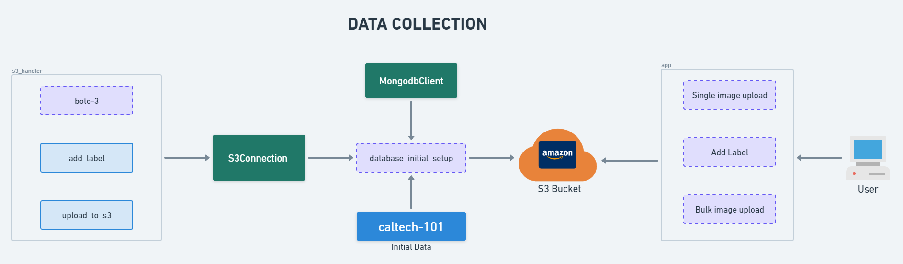

# **Data Collection Endpoint**

This repository is part of a **De-Coupled Microservice Architecture** for implementing an **Image Similarity Search** system. The role of this endpoint is to facilitate **data collection** and storage with proper metadata. It allows users to upload images (in bulk or individually), manage image labels, and store the data securely in an **S3 bucket** while maintaining a record of metadata in **MongoDB**.

---

## **Overview**

The Data Collection Endpoint serves as the first part of the pipeline and includes the following responsibilities:

1. **Image Upload**: 
   - Supports both single and bulk image uploads.
   - Uploaded images are stored in **Amazon S3 buckets** with public access URLs.

2. **Metadata Management**: 
   - Image metadata (e.g., labels/category names) is stored in a **MongoDB database**.
   - Metadata setup enables dynamic model training in subsequent phases.

3. **Dataset Integration (Caltech-101)**:  
   - To simulate real-world user uploads, the **Caltech-101 dataset** has been used as input.  
   - The dataset consists of **101 categories of images** and serves as the initial data for training and testing the system.  
   - Images from this dataset are uploaded to an **S3 bucket** along with their labels stored in MongoDB.

4. **Integration**:
   - Uses **Boto3** for S3 communication.
   - Connects with MongoDB for storing metadata.

---

## **Workflow**

The following workflow explains how the data collection endpoint operates:

1. **Dataset Source**:  
   - **Caltech-101 dataset** is used as the initial source of images.  
   - The dataset is pre-labeled with 101 distinct categories of images.

2. **Data Handling**:  
   - Images are uploaded to the S3 bucket using the **`upload_to_s3`** function.  
   - Labels are added dynamically using the **`add_label`** functionality.  
   - Public access URLs are generated for each uploaded image.

3. **Metadata Storage**:  
   - A connection to **MongoDB** is established using `MongoClient`.  
   - Metadata fields include:
     - `Image URL`: Public access link from S3.  
     - `Label`: Predefined category name from the Caltech-101 dataset.  
     - `Timestamp`: Upload time for the image.  

4. **Public Access**:  
   - Uploaded images in the S3 bucket have public access URLs, enabling other services to fetch and display the images.

---

## **Key Components**

### **1. S3 Handler**
   - **`boto3`**: AWS SDK for Python used to interact with S3.  
   - **`add_label`**: Assign labels to the uploaded images.  
   - **`upload_to_s3`**: Uploads the image(s) to the designated S3 bucket.

### **2. MongoDB Connection**
   - Establishes a connection to MongoDB to store metadata.  
   - **Metadata fields**:  
     - `Image URL`: Public access link from S3.  
     - `Label`: Category or label name for the image.  
     - `Timestamp`: Upload time.

### **3. Dataset - Caltech-101**
   - **Description**:  
     - A dataset consisting of **101 image categories** with labeled data.  
   - **Purpose**:  
     - Simulates real-world bulk data uploads for training and testing.  
   - **Integration**:  
     - The dataset images are uploaded to S3 buckets, and metadata (labels and URLs) is stored in MongoDB.

### **4. Application Interface**
   - Supports:
     - **Single Image Upload**  
     - **Bulk Image Upload**  
     - **Add Labels Dynamically**

---

## **Flowchart**

Below is the flowchart describing the **Data Collection Workflow**:

---

## **Technologies Used**

- **Python**  
- **Boto3**: S3 integration  
- **MongoDB**: Metadata storage  
- **AWS S3**: Image storage  
- **Caltech-101 Dataset**: Input image source for initial implementation  

---

## **Setup Instructions**

\`\`\`bash
1. **Clone the Repository**:  
   git clone <repo-link>
   cd data-collection-endpoint

2. **Install Dependencies**:  
   pip install -r requirements.txt

3. **Environment Configuration**:  
   - Create an **AWS S3 bucket** and set up credentials using Boto3.  
   - Set up **MongoDB** connection strings in the environment variables.

4. **Load Caltech-101 Dataset**:  
   - Download the dataset from Kaggle.  
   - Upload the images to your S3 bucket using the bulk upload functionality.  

5. **Run the Application**:  
   python app.py
\`\`\`

---

## **Usage**

### **Single Image Upload**
   - Call the appropriate endpoint to upload a single image with metadata.  

### **Bulk Image Upload**
   - Upload multiple images at once with dynamic labels (using Caltech-101 dataset for simulation).

---

## **Next Steps**

The collected data and metadata will be used in the **Model Training Endpoint** for embedding generation and training.

---

This structure ensures the **Data Collection Endpoint** is cleanly decoupled and scalable, serving as the foundation for the entire Image Similarity Search system. 🚀
